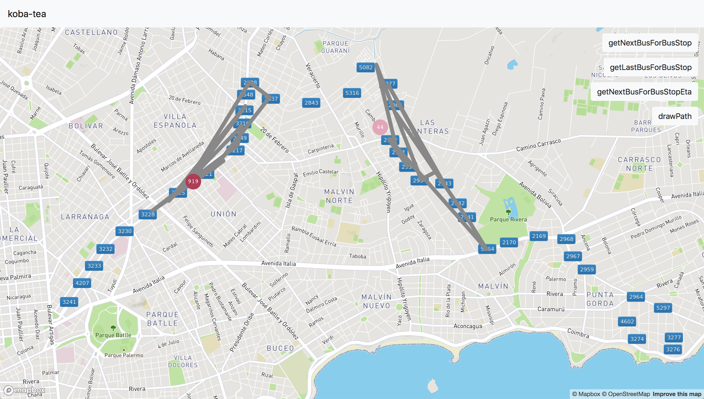

# Desafío TEA

[Manual Técnico](docs/manual-tecnico-desafio-tea%201.4.pdf)

## Requerimientos

* MongoDB
* NodeJS

## Desarrollo 

[Ver DEVELOPMENT.md](DEVELOPMENT.md)

## Playground

Herramienta que permite visualizar los datos de la simulación en tiempo real.

[Ir al playground](https://koba-tea.herokuapp.com/playground)
